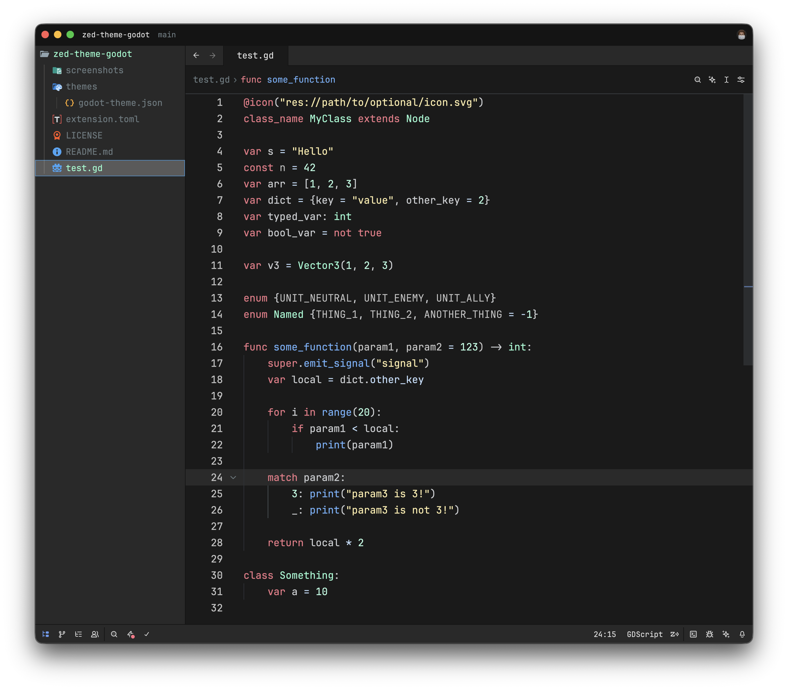

# Godot theme for Zed

> Inspired by the Godot editor and its syntax highlighting theme.

## Installation

1. Open `Command Palette`
2. Select `zed: extensions`
3. Search `Godot Theme`

## Activate Theme

1. Open `Command Palette`
2. Select `theme selector: toggle`
3. Search `Godot`
